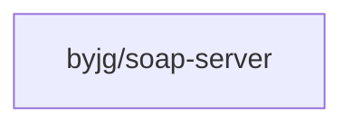

[](https://github.com/byjg/php-soap-server/actions/workflows/phpunit.yml)
[](http://opensource.byjg.com)
[](https://github.com/byjg/php-soap-server/)
[](https://opensource.byjg.com/opensource/licensing.html)
[](https://github.com/byjg/php-soap-server/releases/)

# byjg/soap-server

A lightweight and modern SOAP server implementation for PHP

## Features

TODO: Describe the main features of this SOAP server library

- Feature 1
- Feature 2
- Feature 3

## Installation

```bash
composer require byjg/soap-server
```

## Usage

TODO: Add usage examples

```php
<?php
require 'vendor/autoload.php';

use ByJG\SoapServer\SoapServer;

// Example usage
```

## Dependencies



## Running Tests

```bash
composer install
composer test
```

## Running Static Analysis

```bash
composer psalm
```

## Documentation

TODO: Add link to documentation once available

----
[Open source ByJG](https://opensource.byjg.com)
