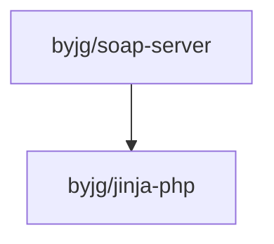

[](https://github.com/byjg/php-soap-server/actions/workflows/phpunit.yml)
[](http://opensource.byjg.com)
[](https://github.com/byjg/php-soap-server/)
[](https://opensource.byjg.com/opensource/licensing.html)
[](https://github.com/byjg/php-soap-server/releases/)

# byjg/soap-server

A lightweight and modern SOAP server implementation for PHP 8.1+

## Features

- 🚀 **Modern PHP 8.1+ Attributes**: Use PHP attributes to define SOAP services declaratively
- 📝 **Auto-generated WSDL**: Automatic WSDL generation from your service definitions
- 🎨 **Beautiful Documentation UI**: Modern, interactive HTML documentation with Jinja templates
- 🔧 **Flexible Configuration**: Support for both attribute-based and programmatic configuration
- 📊 **Type Safety**: Full support for complex types, arrays, and optional parameters
- 🌐 **SOAP 1.1 & 1.2**: Support for both SOAP versions
- 🎯 **Discovery Support**: Built-in DISCO (Discovery) document generation
- 📱 **Responsive Design**: Mobile-friendly service documentation interface

## Installation

```bash
composer require byjg/soap-server
```

## Quick Start

### Using PHP Attributes (Recommended)

```php
<?php

use ByJG\SoapServer\Attributes\{SoapService, SoapOperation, SoapParameter};
use ByJG\SoapServer\SoapAttributeParser;
use ByJG\SoapServer\ResponseWriter;

#[SoapService(
    serviceName: 'CalculatorService',
    namespace: 'http://example.com/calculator',
    description: 'A simple calculator web service'
)]
class Calculator
{
    #[SoapOperation(description: 'Adds two numbers together')]
    public function add(
        #[SoapParameter(description: 'First number')] int $a,
        #[SoapParameter(description: 'Second number')] int $b
    ): int {
        return $a + $b;
    }

    #[SoapOperation(description: 'Subtracts second from first')]
    public function subtract(int $a, int $b): int
    {
        return $a - $b;
    }
}

// Start the service
$handler = SoapAttributeParser::parse(Calculator::class);
$response = $handler->handle();
ResponseWriter::output($response);
```

### Using Programmatic Configuration

```php
<?php

use ByJG\SoapServer\{SoapHandler, SoapOperationConfig, SoapParameterConfig, SoapType};
use ByJG\SoapServer\ResponseWriter;

$addOperation = new SoapOperationConfig();
$addOperation->description = 'Adds two numbers';
$addOperation->args = [
    new SoapParameterConfig('a', SoapType::Integer),
    new SoapParameterConfig('b', SoapType::Integer)
];
$addOperation->returnType = SoapType::Integer;
$addOperation->executor = function(array $params) {
    return $params['a'] + $params['b'];
};

$handler = new SoapHandler(
    soapItems: ['add' => $addOperation],
    serviceName: 'CalculatorService'
);
$response = $handler->handle();
ResponseWriter::output($response);
```

## Running the Service

Start PHP's built-in web server:

```bash
php -S localhost:8080 calculator.php
```

Then access:
- **Service Documentation**: [http://localhost:8080](http://localhost:8080)
- **WSDL**: [http://localhost:8080?wsdl](http://localhost:8080?wsdl)
- **DISCO**: [http://localhost:8080?DISCO](http://localhost:8080?disco)


## Running Tests

```bash
composer install
composer test
```

## Running Static Analysis

```bash
composer psalm
```

## Documentation

Comprehensive documentation is available:

- [Getting Started](docs/getting-started.md) - Create your first SOAP service
- [Using Attributes](docs/using-attributes.md) - Attribute-based configuration guide
- [Programmatic Configuration](docs/programmatic-configuration.md) - API-based configuration
- [Complex Types](docs/complex-types.md) - Working with custom classes and objects
- [Templates](docs/templates.md) - Customizing the service documentation UI

## License and Acknowledgments

This project is licensed under the [MIT License](LICENSE).

**Note**: Parts of this codebase were derived from an older PHP class originally licensed under the PHP License. The
original code has been modernized and adapted for this project. For detailed information about the licensing and
acknowledgments, see [License Acknowledgments](docs/license-acknowledgments.md).

## Dependencies



----
[Open source ByJG](https://opensource.byjg.com)
